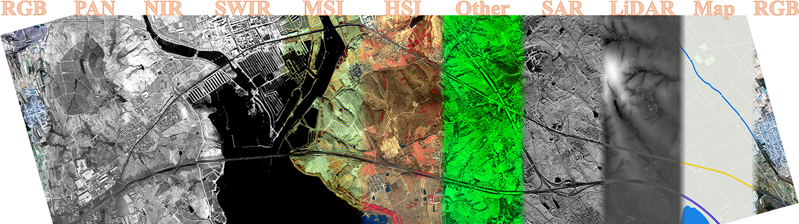
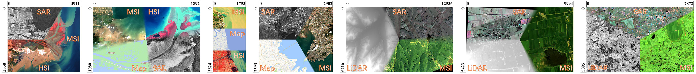

# HIMO: Cross-Arbitrary-Modality Image Invariant Feature Transform with Hierarchical Intrinsic Major Orientation


Paper Link: https://ieeexplore.ieee.org/document/11435911/

If you have any queries or suggestions, please do not hesitate to contact me (gao-pingqi@qq.com). If you are from China, you may just speak Chinese~ 中国人直接说中文就可以了~


## 📈 Matching Performance
A new image matching method of traditional handcrafted framework with the following effects: (2025.03.20)

Affine (rotation + scaling) distorsion:
<table>
  <tr>
    <td align="center">One-stage</td>
    <td align="center">Two-stage</td>
  </tr>
  <tr>
    <td align="center">
      
    </td>
    <td align="center">
      
    </td>
  </tr>
</table>

Projective / Perspective / Homography distorsion:
<table>
  <tr>
    <td align="center">One-stage</td>
    <td align="center">Two-stage</td>
  </tr>
  <tr>
    <td align="center">
      
    </td>
    <td align="center">
      
    </td>
  </tr>
</table>

General Cross-Modal Image Matching:


Datasets Matching Performance:


Dense-like Matching Performance:


## 📦 Datasets Release

** The author is now busy with graduation, causing a delay of datasets release. The datasets and revised labels will be publicly available soon.

*** Full GCZ dataset ***



Google Drive: https://drive.google.com/drive/folders/1yZo3ZPxVuUrHbXJwNKEMEuBSVmOVihzM?usp=sharing

Baidu Netdisk: https://pan.baidu.com/s/10d-xgjO15qu9sjRZVanJAQ?pwd=dgcz

<br>

*** Full WDS dataset ***



Google Drive: https://drive.google.com/drive/folders/1wxwu0ZAR2a0HA9rEfC11guZsw3cksYZu?usp=sharing

Baidu Netdisk: https://pan.baidu.com/s/1n6GrHdKKTSMmTXaMe88IBg?pwd=dwds

<br>

*** Revised MRSI<sup>[1-2]</sup> dataset labels ***

Google Drive: https://drive.google.com/file/d/1joFkfeCJnGtkL9zZp2FSR0ZTr0wBP5zj/view?usp=sharing

Baidu Netdisk: https://pan.baidu.com/s/1LwqD7OBxQDFpxatWIO56Rw?pwd=mrsi

<br>

*** Revised SRIF<sup>[3]</sup> dataset labels ***

Google Drive: https://drive.google.com/file/d/1ODZDtKcN_7KkvXk4XOQhSOqCVWGK0tp4/view?usp=sharing

Baidu Netdisk: https://pan.baidu.com/s/14GsQMeiYV_8kTP5CZiSX1w?pwd=srif

<br>

*[1] J. Li, Q. Hu, and M. Ai, “RIFT: Multi-modal image matching based on radiation-variation insensitive feature transform,” IEEE Transactions on Image Processing, vol. 29, pp. 3296–3310, 2019.*

*[2] Y. Yao, Y. Zhang, Y. Wan, X. Liu, X. Yan, and J. Li, “Multi-modal remote sensing image matching considering co-occurrence filter,” IEEE Transactions on Image Processing, vol. 31, pp. 2584–2597, 2022.*

*[3] J. Li, Q. Hu, and Y. Zhang, “Multimodal image matching: A scale invariant algorithm and an open dataset,” ISPRS Journal of Photogrammetry and Remote Sensing, vol. 204, pp. 77–88, 2023.*


## 📚 Citation
If you find our work useful in your research, please consider citing:
```bibtex
@article{gao2026himo,
  author={Gao, Chenzhong and Li, Wei and Weng, Desheng and Tao, Ran and Xia, Xiang-Gen and Du, Qian},
  journal={IEEE Transactions on Pattern Analysis and Machine Intelligence}, 
  title={{HIMO}: Cross-Arbitrary-Modality Image Invariant Feature Transform with Hierarchical Intrinsic Major Orientation}, 
  year={2026},
  pages={1-18},
  publisher={IEEE}
}
```
