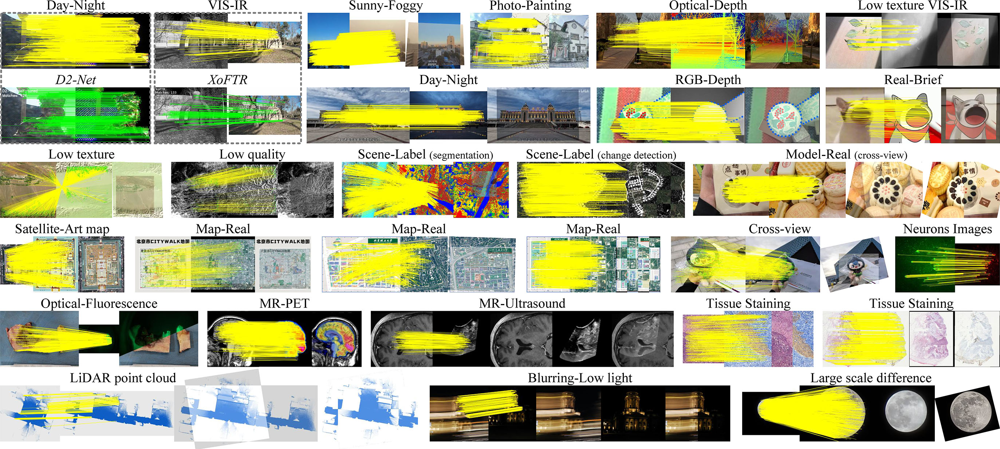

# HIMO_ImgMatching
HIMO: Cross-Arbitrary-Modality Image Invariant Feature Transform with Hierarchical Intrinsic Major Orientation

General Cross-Modal Image Matching:

A new image matching method of traditional handcrafted framework with the following effects: (2025.03.20)
<table>
  <tr>
    <td align="center">One-stage</td>
    <td align="center">Two-stage</td>
  </tr>
  <tr>
    <td align="center">
      
    </td>
    <td align="center">
      
    </td>
  </tr>
</table>

<table>
  <tr>
    <td align="center">One-stage</td>
    <td align="center">Two-stage</td>
  </tr>
  <tr>
    <td align="center">
      
    </td>
    <td align="center">
      
    </td>
  </tr>
</table>

General Cross-Modal Image Matching:

Datasets Matching Performance:

Dense-like Matching Performance:

